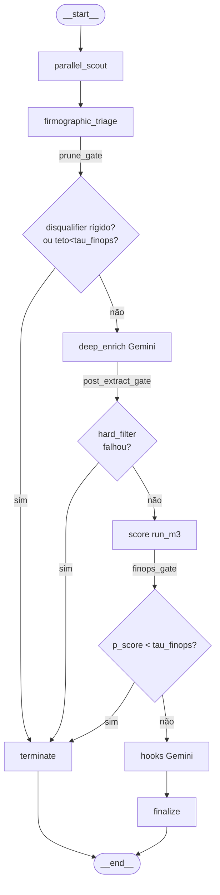

# SDD — Camada de Orquestração Paralela & FinOps (LangGraph)

> **Status:** **APROVADA (v1.1 — endurecida por revisão crítica do dono, 2026-06-03)**.
> Escopo autorizado por **ADR-003** (emenda ao ADR-000 §5). Spec-first: este documento
> precede o código. Segue o SDD-to-Code Loop do repositório (contrato → BDD+fixtures →
> implementação → gate `ruff`+`mypy --strict`+`pytest` → PR).
>
> **Histórico de revisão — v1.1 (endurecimentos da WU-G4):** (a) §1.2 `asyncio.gather`
> com `return_exceptions=True` **+** conversão de exceção crua em `SensorError(SERVER)`
> sem estourar o runtime; (b) §2.2 triagem **conservadora** de `menos_de_2_anos` com
> guarda de **contexto de fundação** (prefere falso-prosseguir a falso-podar; ambíguo
> ⇒ defere ao portão semântico); (c) §5 invariante explícito de estabilidade do
> `evidence_id` (hashing com `sort_keys=True`).
>
> **Princípio reitor:** o grafo orquestra **I/O e controle**; o **scoring permanece
> puro e determinístico** (`m3_score.run_m3`, `m4_ranking.run_m4` inalterados). Nada
> aqui reimplementa a matemática do `p_score`, o Hard Filter por `DISQUALIFIER_VOCAB`
> nem o `persona_fit`.

---

## 0. Premissas, invariantes e reaproveitamento do repositório

| Invariante (não negociável) | Origem no repo | Como o grafo respeita |
|---|---|---|
| Hard Filter por desqualificador rígido zera o lead | `signals.DISQUALIFIER_VOCAB`, `m3_score._score_one` | Poda precoce (§2) é um **atalho de FinOps** para o MESMO veredito; nunca um critério novo |
| `Intent = Σ priors das hipóteses ativadas` | `m3_score._intent_from_hypotheses` | Calculado por `run_m3` puro, após a colheita |
| `persona_fit` (homem→0, empresa↓) | `m3_score._persona_fit`, `[persona]` | Inalterado; multiplicador aplicado por `run_m3` |
| Determinismo byte-idêntico | regra §3.2 | Evidência fundida por `evidence_id`+ordenada; M3/M4 puros; RNG/clock injetados nos testes |
| Persistência atômica JSON, database-less | `core.cache.JsonCache`, `core.atomic.atomic_write_text` | Cache de provedores reusa `JsonCache` (chave = `query_hash`) |
| Sem scraping de navegador | ADR-000 §5 | Colheita só via APIs REST (Tavily/Brave/Google CSE) |
| Contratos `extra="forbid"` | `contracts.py` | Novos schemas (§4) são **aditivos**, em `graph/schemas.py` |

**Contratos dormentes que esta camada finalmente ativa:** `OperatingMode`
(`NORMAL|DEGRADED_TAVILY|DEGRADED_GEMINI|CACHE_ONLY`), `DataQualityFlag`
(`OK|DEGRADED`) e `runtime.toml [finops]` (`tau_finops=0.60`, `kappa_degraded=0.80`).

**Dependências novas:** `langgraph` (extra `[graph]`). `httpx` (já presente) em modo
**async** (`httpx.AsyncClient`). Chaves opcionais no `.env`: `BRAVE_API_KEY`,
`GOOGLE_CSE_KEY`, `GOOGLE_CSE_CX`.

**Granularidade:** o grafo modela o **ciclo de vida de UM lead** (`LeadState`). Um
*runner* assíncrono faz fan-out do lote (N leads) com semáforo de concorrência
(§1.4), reaproveitando a descoberta inicial (onda M1 sobre o ICP) como geradora de
sementes de lead.

---

## 1. Topologia e concorrência do grafo (LangGraph)

### 1.1 `LeadState` (TypedDict com reducers de concorrência)

O estado é um `TypedDict` (estado nativo do LangGraph). Campos **acumulados por nós
concorrentes** usam `Annotated[..., operator.add]` (reducer aditivo); campos de
substituição usam *last-write-wins*. Os **valores** são instâncias dos contratos
Pydantic existentes (`ObservedEvidence`, `Inference`, `ProspectScore`, `XAIPayload`,
`LeadCard`) e dos novos schemas da §4 — o `TypedDict` é a *moldura*, os contratos são
o *conteúdo validado*.

```python
# src/socialselling/graph/state.py
from __future__ import annotations

import operator
from typing import Annotated, TypedDict

from socialselling.contracts import (
    DataQualityFlag, HypothesisCatalog, ICPCriteria, Inference,
    LeadCard, ObservedEvidence, OperatingMode, ProspectScore, XAIPayload,
)
from socialselling.graph.schemas import (
    FinOpsLedger, LeadSeed, ProviderHealth, PruneVerdict, SensorError,
)


class LeadState(TypedDict, total=False):
    # --- Entrada imutável (injetada uma vez) ---
    icp: ICPCriteria
    catalog: HypothesisCatalog
    seed: LeadSeed
    now: str                      # relógio ISO injetado (determinismo)

    # --- Acumuladores concorrentes (reducer = operator.add) ---
    evidence: Annotated[list[ObservedEvidence], operator.add]
    providers: Annotated[list[ProviderHealth], operator.add]
    sensor_errors: Annotated[list[SensorError], operator.add]
    missing_evidence: Annotated[list[str], operator.add]   # chaves/provedores ausentes

    # --- Estado de redução (last-write-wins) ---
    inference: Inference | None
    score: ProspectScore | None
    xai: XAIPayload | None
    lead_card: LeadCard | None

    # --- Governança de execução ---
    operating_mode: OperatingMode
    data_quality: DataQualityFlag
    prune: PruneVerdict | None
    ledger: FinOpsLedger
```

> **Por que `evidence` é reducer-aditivo:** mesmo com o `ParallelScoutNode` único
> (§1.2), manter o reducer permite evoluir para fan-out real (um nó por provedor) sem
> mudar o estado. A ordem de chegada não importa: a §1.5 funde por `evidence_id` e
> **ordena** antes de qualquer uso, preservando o determinismo.

### 1.2 `ParallelScoutNode` — colheita concorrente (`asyncio.gather`)

Um **único nó assíncrono** dispara as buscas estruturadas em paralelo via
`asyncio.gather(..., return_exceptions=True)`. Cada provedor implementa o Protocol
**`AsyncSearchClient`** e normaliza a saída para o formato canônico Tavily
(`{"results":[{"title","url","content","score"}]}`), de modo que o mapeamento de
evidência (`m1_busca._map_result`) e o prompt do M2 funcionem **sem alteração**.

```python
# src/socialselling/graph/providers/base.py
from typing import Any, Protocol

class AsyncSearchClient(Protocol):
    """Provedor de busca estruturada (Tavily/Brave/Google CSE), assíncrono."""
    name: str
    async def search(
        self, query: str, max_results: int, include_domains: list[str] | None = None
    ) -> dict[str, Any]: ...   # retorna {"results":[{title,url,content,score}]}
```

```python
# src/socialselling/graph/nodes/scout.py
import asyncio
from socialselling.graph.retry import with_retry           # §3.3
from socialselling.graph.finops import ledger_add
from socialselling.graph.providers.base import AsyncSearchClient
from socialselling.modules.m1_busca import _map_result      # reuso do mapeamento canônico

async def parallel_scout(state: LeadState, *, clients: list[AsyncSearchClient],
                         policy: "RetryPolicy", rng) -> dict:
    plan = build_scout_plan(state["seed"], state["icp"])    # ScoutPlan (§4)
    now = parse_now(state["now"])

    async def _probe(client: AsyncSearchClient):
        return await with_retry(                            # backoff+jitter, §3.3
            provider=client.name,
            call=lambda: client.search(plan.query, plan.max_results, plan.include_domains),
            policy=policy, rng=rng,
        )

    # return_exceptions=True é OBRIGATÓRIO: uma exceção crua de UM provedor (ex.: falha
    # de DNS, erro interno de lib) NÃO pode derrubar a fila dos provedores saudáveis.
    outcomes = await asyncio.gather(*[_probe(c) for c in clients], return_exceptions=True)

    evidence, healths, errors, missing = [], [], [], []
    for client, out in zip(clients, outcomes):
        # Defesa em profundidade: with_retry (§3.3) já converte falhas CONHECIDAS em
        # ProviderOutcome(ok=False). Aqui capturamos o INESPERADO que escapou do retry
        # e o convertemos em SensorError(SERVER) — sem estourar o runtime local.
        if isinstance(out, BaseException):
            errors.append(SensorError(
                provider=client.name, kind=SensorErrorKind.SERVER, status_code=None,
                attempts=policy.max_attempts, message=repr(out), at=state["now"]))
            missing.append(client.name)
            healths.append(ProviderHealth(provider=client.name, ok=False,
                                          results=0, attempts=policy.max_attempts))
            continue
        if out.ok:
            mapped = [_map_result(plan.query, r, now) for r in out.payload.get("results", [])]
            evidence += mapped
            healths.append(ProviderHealth(provider=client.name, ok=True,
                                          results=len(mapped), attempts=out.attempts))
        else:
            errors.append(out.error)                        # SensorError (§4)
            missing.append(client.name)
            healths.append(ProviderHealth(provider=client.name, ok=False,
                                          results=0, attempts=out.attempts))

    mode = derive_operating_mode(healths)                   # §3.2
    return {
        "evidence": evidence, "providers": healths,
        "sensor_errors": errors, "missing_evidence": missing,
        "operating_mode": mode,
        "ledger": ledger_add(state["ledger"], search_calls=len(clients)),
    }
```

> **Anti-bloqueio:** ao consultar 3 APIs limpas em paralelo e aceitar o que retornar,
> um 429/timeout isolado vira *evidência ausente*, não falha. **Nunca** há fallback
> para scraping de navegador (ADR-000 §5) — a redundância é por **provedores**, não
> por *headless browser*.

### 1.3 Demais nós

| Nó | Tipo | Custo | Responsabilidade |
|---|---|---|---|
| `parallel_scout` | async, I/O | barato (busca) | colhe firmográficos cadastrais em 3 provedores |
| `firmographic_triage` | **puro/determinístico** | **zero** | popula `inference` preliminar + subconjunto **barato** de `disqualifiers` (§2.2) |
| `deep_enrich` | async, **Gemini** | **caro** | M2 completo: `intent_signals`, `persona`, contato, desqualificadores semânticos |
| `score` | **puro** (`run_m3`) | zero | `ProspectScore` determinístico (intent, persona_fit, p_score) |
| `hooks` | async, **Gemini** | **caro** | M5+ ganchos/comitê (geração de abordagem) |
| `finalize` | puro | zero | monta `LeadCard` |
| `terminate` | puro | zero | sela `PruneVerdict`, zera/escreve veredito, vai a `__end__` |

### 1.4 Arestas — diagrama (Mermaid + textual)



**Arestas exatas** (assinatura LangGraph):

```python
# src/socialselling/graph/build.py
from langgraph.graph import StateGraph, START, END
from socialselling.graph.state import LeadState
from socialselling.graph import edges, nodes

def build_lead_graph(deps: "GraphDeps"):
    g = StateGraph(LeadState)
    g.add_node("parallel_scout",      nodes.bind(nodes.parallel_scout, deps))
    g.add_node("firmographic_triage", nodes.firmographic_triage)        # puro
    g.add_node("deep_enrich",         nodes.bind(nodes.deep_enrich, deps))
    g.add_node("score",               nodes.score)                      # run_m3 puro
    g.add_node("hooks",               nodes.bind(nodes.hooks, deps))
    g.add_node("finalize",            nodes.finalize)
    g.add_node("terminate",           nodes.terminate)

    g.add_edge(START, "parallel_scout")
    g.add_edge("parallel_scout", "firmographic_triage")
    g.add_conditional_edges("firmographic_triage", edges.prune_gate,
                            {"deep_enrich": "deep_enrich", "terminate": "terminate"})
    g.add_conditional_edges("deep_enrich", edges.post_extract_gate,
                            {"score": "score", "terminate": "terminate"})
    g.add_conditional_edges("score", edges.finops_gate,
                            {"hooks": "hooks", "terminate": "terminate"})
    g.add_edge("hooks", "finalize")
    g.add_edge("finalize", END)
    g.add_edge("terminate", END)
    return g.compile()
```

### 1.5 Runner de lote (fan-out concorrente, determinístico na redução)

```python
# src/socialselling/graph/runner.py
import asyncio

async def run_batch(seeds: list[LeadSeed], *, icp, catalog, deps,
                    max_concurrency: int = 8) -> list[LeadCard]:
    graph = build_lead_graph(deps)
    sem = asyncio.Semaphore(max_concurrency)         # respeita quotas de tier gratuito

    async def _one(seed: LeadSeed):
        async with sem:
            final = await graph.ainvoke(initial_state(seed, icp, catalog, deps.now))
            return final.get("lead_card")            # None se podado

    cards = [c for c in await asyncio.gather(*[_one(s) for s in seeds]) if c is not None]
    # Ordenação final determinística = a MESMA de M4 (puro): -p_score, company_id
    from socialselling.modules.m4_ranking import run_m4
    ordered = run_m4([c.score for c in cards])
    by_id = {c.score.company_id: c for c in cards}
    return [rerank(by_id[s.company_id], i + 1) for i, s in enumerate(ordered)]
```

> **Determinismo na fronteira:** a colheita é concorrente, mas a **redução final**
> (`run_m4`) é pura e estável (tie-break por `company_id`). Dado o mesmo cache de
> evidência, a saída ranqueada é byte-idêntica — `max_concurrency` afeta latência, não
> resultado.

---

## 2. Mecanismo de Poda Precoce (Early Pruning Edge)

### 2.1 A borda condicional `prune_gate`

Imediatamente após `firmographic_triage` (dados cadastrais baratos, **sem Gemini**),
uma **Conditional Edge** decide entre continuar para `deep_enrich` (caro) ou abortar
para `terminate`/`__end__`.

```python
# src/socialselling/graph/edges.py
from socialselling.signals import DISQUALIFIER_VOCAB
from socialselling.graph.finops import provisional_ceiling   # melhor p_score possível

def prune_gate(state: LeadState) -> str:
    inf = state["inference"]
    # (A) PODA RÍGIDA — paridade exata com o Hard Filter do m3_score
    if set(inf.disqualifiers) & set(DISQUALIFIER_VOCAB):
        return "terminate"
    # (B) PODA FINOPS — Progressive Early Termination (tau_finops)
    #     teto = melhor p_score atingível assumindo intent máximo (=1.0).
    if provisional_ceiling(inf, state["icp"], state["catalog"]) < state["ledger"].tau_finops:
        return "terminate"
    return "deep_enrich"
```

```python
# nodes.terminate sela o veredito sem custo de IA
def terminate(state: LeadState) -> dict:
    inf = state["inference"]
    hard = bool(set(inf.disqualifiers) & set(DISQUALIFIER_VOCAB))
    verdict = PruneVerdict(
        pruned=True,
        gate="firmographic_disqualifier" if hard else "finops_ceiling",
        reason=", ".join(sorted(set(inf.disqualifiers) & set(DISQUALIFIER_VOCAB))) or "teto<tau",
    )
    zero = ProspectScore(company_id=inf.company.company_id, fit=0.0, intent=0.0,
                         confidence=inf.confidence, persona_fit=0.0, p_score=0.0,
                         hard_filter_passed=not hard)
    return {"prune": verdict, "score": zero,
            "ledger": ledger_mark_pruned(state["ledger"], hard=hard)}
```

> **Garantia de correção:** a poda **nunca** descarta um lead que `run_m3` aprovaria.
> Ramo (A) usa o **mesmo** `DISQUALIFIER_VOCAB`/predicado do `m3_score`. Ramo (B) usa
> um **teto otimista** (intent = 1.0): só poda quando *nem no melhor cenário* o lead
> alcança `tau_finops`. É uma poda **conservadora e auditável**.

### 2.2 Detectabilidade barata vs. semântica

Nem todo desqualificador é detectável sem IA. Particionamos o vocabulário:

```python
# src/socialselling/graph/triage.py
CHEAP_DETECTABLE = {            # heurística determinística sobre firmográficos cadastrais
    "fora_de_setor",           # indústria detectada ∉ icp.firmographics.industries
    "perfil_pessoal_sem_empresa",  # nenhuma entidade-empresa nos resultados
    "menos_de_2_anos",         # SÓ com ano de fundação CONFIÁVEL (ver guarda abaixo)
}
SEMANTIC_ONLY = DISQUALIFIER_VOCAB_SET - CHEAP_DETECTABLE  # exige Gemini (deep_enrich)
# solo_sem_equipe, multiplas_socias_sem_decisor, retracao_corte_custos
```

`firmographic_triage` popula `inference.disqualifiers` **apenas** com o subconjunto
barato; os semânticos continuam sendo detectados pelo M2 em `deep_enrich` (segundo
portão, `post_extract_gate`). Há, portanto, **duas barreiras**: a barata (pré-Gemini)
e a existente (pós-Gemini), ambas convergindo no mesmo veredito do `run_m3`.

#### 2.2.1 Triagem conservadora do ano (`menos_de_2_anos`) — guarda anti-falso-positivo

Snippets de busca trazem datas **truncadas/ambíguas** ("Fundada há 18 meses…",
"© 2010", "evento 2025"). Uma extração ingênua (qualquer `YYYY`) produziria tanto
**falso-negativo** (não lê a data → aprova p/ Gemini por engano) quanto, pior,
**falso-positivo** (lê um ano avulso → **poda um lead bom**). **Política:** a triagem
só marca `menos_de_2_anos` quando há `YYYY` num **contexto de fundação explícito**;
qualquer ambiguidade **defere** ao portão semântico (lead segue — preferimos pagar
Gemini a podar por engano).

```python
import re

# Exige um SINAL de fundação adjacente ao ano — evita anos avulsos (copyright, eventos).
_FOUNDING_YEAR_RE = re.compile(
    r"(?:fundad[ao]|criad[ao]|desde|atuando\s+desde|opera(?:ndo)?\s+desde|"
    r"founded|established|since)\D{0,12}((?:19|20)\d{2})",
    re.IGNORECASE,
)

def founding_year(blob: str) -> int | None:
    """Ano YYYY com contexto de fundação claro; None se ambíguo/ausente (⇒ defere)."""
    anos = [int(m.group(1)) for m in _FOUNDING_YEAR_RE.finditer(blob)]
    return min(anos) if anos else None

def maybe_mark_age(blob: str, now_year: int) -> list[str]:
    ano = founding_year(blob)
    if ano is not None and 0 <= (now_year - ano) < 2:
        return ["menos_de_2_anos"]     # data CONFIÁVEL e idade < 2 anos
    return []                          # ambíguo/sem contexto ⇒ NÃO marca (defere ao M2)
```

> **Invariante de poda segura:** na dúvida, a triagem **nunca poda** — apenas o portão
> semântico (Gemini) pode reprovar por idade quando a triagem barata não tem certeza.
> Falso-negativo custa 1 chamada Gemini; falso-positivo perderia um cliente — a
> assimetria de custo justifica a conservadoria.

### 2.3 FinOps Guard — economia em lote de 100 leads ruidosos

**Premissas (ilustrativas, rotuladas):** por **lead qualificado** gastamos ~2 chamadas
Gemini — extração M2 (~1.800 in / ~600 out) + ganchos M5+ (~900 in / ~400 out) ≈
**3.700 tokens**. Lead **podado na triagem** = **0 chamadas Gemini** (só 3 buscas
baratas). Lote "altamente ruidoso": **68%** disparam desqualificador barato
(`fora_de_setor` domina o ruído).

| Métrica (lote = 100) | Sem poda precoce | Com poda precoce (68% podados) | Economia |
|---|---|---|---|
| Chamadas Gemini | 100 × 2 = **200** | 32 × 2 = **64** | **−136 (−68%)** |
| Tokens Gemini (aprox.) | **~370k** | **~118k** | **~252k** |
| Buscas (tier grátis) | 300 | 300 | 0 (são o *tripwire* barato) |
| Risco de **429 Gemini** | estoura quota diária | dentro da quota | evita parada do lote |
| Latência do lote | alta (Gemini em todos) | ~1/3 | menor *wall-clock* |

> **Insight de FinOps:** o gargalo de quota no tier gratuito é o **Gemini (RPD)**, não
> a busca. A poda troca 1 chamada cara por 3 baratas e **mantém o lote sob a quota** —
> a diferença entre *terminar* e *travar em 429*. A segunda barreira (`finops_gate`
> pós-`score`, `p_score < tau_finops`) ainda evita gastar **hooks** em leads que
> passaram na extração mas ficaram abaixo do limiar.

---

## 3. Tolerância a falhas e gestão de incerteza (Open-World Resilience)

### 3.1 Política por classe de falha

| Evento | Provedor de busca (Tavily/Brave/CSE) | Gemini |
|---|---|---|
| **429 Rate Limit** | backoff+jitter (§3.3) → se esgotar, marca provedor ausente, segue com os demais | backoff+jitter → se esgotar, **não** extrai: `inference` fica em baixa confiança; lead vai p/ `DEGRADED_GEMINI` |
| **Timeout/Network** | idem 429 (falha tolerável de sensor) | idem |
| **5xx** | failover na ordem `providers` | retry limitado |
| **Parse inválido** | descarta resultado do provedor, registra `SensorError(kind=PARSE)` | trata como falha de extração |
| **Auth/sem chave** | provedor simplesmente ausente (Brave/CSE são opcionais) | erro de configuração explícito |

**Failover de busca:** o `ParallelScoutNode` consulta todos em paralelo; basta **um**
provedor responder para haver evidência. Zero provedores → `CACHE_ONLY` (usa o
`JsonCache` frio, se houver) ou evidência vazia + `data_quality=DEGRADED`.

### 3.2 Modo Degradado, rebaixamento de `confidence` e Missing Evidence

```python
# src/socialselling/graph/finops.py  (derivação de modo + penalidade)
from socialselling.contracts import DataQualityFlag, OperatingMode

def derive_operating_mode(healths: list[ProviderHealth]) -> OperatingMode:
    ok = [h.provider for h in healths if h.ok]
    if not ok:
        return OperatingMode.CACHE_ONLY
    if len(ok) < len(healths):
        # se o provedor primário (Tavily) caiu, sinaliza explicitamente
        return (OperatingMode.DEGRADED_TAVILY
                if "tavily" not in ok else OperatingMode.NORMAL)
    return OperatingMode.NORMAL

def degraded_factor(healths: list[ProviderHealth], kappa: float) -> float:
    """Rebaixa confidence PROPORCIONALMENTE à cobertura, com piso = kappa_degraded."""
    planned = max(1, len(healths))
    coverage = sum(1 for h in healths if h.ok) / planned
    return kappa + (1.0 - kappa) * coverage          # ∈ [kappa, 1.0]
```

No `deep_enrich`, ao montar a `Inference`, aplica-se o fator e registram-se as chaves
ausentes — **sem quebrar a execução local**:

```python
factor = degraded_factor(state["providers"], kappa=state["ledger"].kappa_degraded)
inference = inference.model_copy(update={
    "confidence": round(inference.confidence * factor, 9),
    "company": inference.company.model_copy(update={
        "confidence": round(inference.company.confidence * factor, 9)}),
})
# Missing Evidence para auditoria no Cockpit:
data_quality = DataQualityFlag.DEGRADED if state["missing_evidence"] else DataQualityFlag.OK
# state["missing_evidence"] já contém os provedores ausentes (reducer-acumulado);
# o XAIPayload (M5) recebe degraded_mode=True e missing_signals += missing_evidence.
```

> **Open-World fiel ao §3.3 do CLAUDE.md:** ausência de sinal = **incerteza** (rebaixa
> `confidence`, registra `missing_evidence`), **nunca** um falso. A degradação é
> proporcional (cobertura), com piso configurável `kappa_degraded` (0.80) — reusando o
> `[finops]` existente.

### 3.3 Backoff exponencial com *full jitter* (na fila async)

```python
# src/socialselling/graph/retry.py
import asyncio
from socialselling.graph.schemas import RetryPolicy, SensorError, SensorErrorKind

def backoff_delay(policy: RetryPolicy, attempt: int, rng) -> float:
    """Full jitter: U(0, min(cap, base * 2**(attempt-1)))."""
    ceiling = min(policy.cap_seconds, policy.base_seconds * (2 ** (attempt - 1)))
    return rng.uniform(0.0, ceiling) if policy.jitter else ceiling

async def with_retry(*, provider: str, call, policy: RetryPolicy, rng) -> "ProviderOutcome":
    attempt = 0
    while True:
        attempt += 1
        try:
            payload = await call()
            return ProviderOutcome(provider=provider, ok=True, payload=payload, attempts=attempt)
        except RateLimitError as exc:
            kind, status = SensorErrorKind.RATE_LIMIT, 429
        except (TimeoutError,) as exc:
            kind, status = SensorErrorKind.TIMEOUT, None
        except (TavilyError, GeminiError) as exc:
            kind, status = SensorErrorKind.NETWORK, None
        if attempt >= policy.max_attempts:
            err = SensorError(provider=provider, kind=kind, status_code=status,
                              attempts=attempt, message=str(exc), at=now_iso())
            return ProviderOutcome(provider=provider, ok=False, error=err, attempts=attempt)
        await asyncio.sleep(backoff_delay(policy, attempt, rng))
```

> **Determinismo nos testes:** `rng` é um `random.Random(seed)` **injetado**; com
> `policy.jitter=False` ou seed fixa, os atrasos são reprodutíveis. `asyncio.sleep` é
> *patchável* (mock) para testes instantâneos. O resultado funcional (evidência/score)
> **não depende** do tempo de espera — só do payload final, que vem do mock/fixture.

---

## 4. Modelagem dos contratos expandidos (Pydantic, `extra="forbid"`)

Novos schemas **aditivos** em `src/socialselling/graph/schemas.py` (não tocam
`contracts.py`; não adicionam campos a `Inference`/`ProspectScore` — o controle do
grafo vive no `LeadState`/nestes modelos, preservando os contratos de dados).

```python
# src/socialselling/graph/schemas.py
from __future__ import annotations
from enum import StrEnum
from pydantic import BaseModel, ConfigDict, Field


class SensorErrorKind(StrEnum):
    RATE_LIMIT = "RATE_LIMIT"; TIMEOUT = "TIMEOUT"; NETWORK = "NETWORK"
    SERVER = "SERVER"; PARSE = "PARSE"; AUTH = "AUTH"


class SensorError(BaseModel):
    model_config = ConfigDict(extra="forbid")
    provider: str
    kind: SensorErrorKind
    status_code: int | None = None
    attempts: int = Field(ge=1)
    message: str
    at: str                                   # ISO-8601 (relógio injetado)


class ProviderHealth(BaseModel):
    model_config = ConfigDict(extra="forbid")
    provider: str
    ok: bool
    results: int = Field(ge=0, default=0)
    attempts: int = Field(ge=1, default=1)


class LeadSeed(BaseModel):
    """Semente de lead emitida pela descoberta (onda M1 sobre o ICP)."""
    model_config = ConfigDict(extra="forbid")
    seed_id: str
    display_hint: str | None = None
    company_hint: str | None = None
    source_url: str | None = None
    query: str                                # consulta firmográfica base


class ScoutPlan(BaseModel):
    model_config = ConfigDict(extra="forbid")
    query: str
    max_results: int = Field(ge=1, le=20, default=5)
    include_domains: list[str] = Field(default_factory=list)


class RetryPolicy(BaseModel):
    model_config = ConfigDict(extra="forbid")
    max_attempts: int = Field(ge=1, default=3)        # runtime [gemini].max_retries
    base_seconds: float = Field(ge=0.0, default=2.0)  # runtime [gemini].backoff_base_seconds
    cap_seconds: float = Field(ge=0.0, default=30.0)
    jitter: bool = True


class BudgetPolicy(BaseModel):
    """Carregada de runtime.toml [finops] (estendido)."""
    model_config = ConfigDict(extra="forbid")
    tau_finops: float = Field(ge=0.0, le=1.0, default=0.60)
    kappa_degraded: float = Field(ge=0.0, le=1.0, default=0.80)
    max_gemini_calls: int = Field(ge=0, default=300)         # quota diária do tier
    max_search_calls_per_lead: int = Field(ge=1, default=3)
    providers: list[str] = Field(default_factory=lambda: ["tavily", "brave", "google_cse"])
    max_concurrency: int = Field(ge=1, default=8)


class FinOpsLedger(BaseModel):
    """Contadores + limites do orçamento de um run (sem estado externo)."""
    model_config = ConfigDict(extra="forbid")
    tau_finops: float = 0.60
    kappa_degraded: float = 0.80
    search_calls: int = 0
    gemini_calls: int = 0
    gemini_in_tokens: int = 0
    gemini_out_tokens: int = 0
    pruned_hard: int = 0
    pruned_finops: int = 0
    completed: int = 0


class PruneVerdict(BaseModel):
    model_config = ConfigDict(extra="forbid")
    pruned: bool
    gate: str            # firmographic_disqualifier | finops_ceiling | post_extract_hard_filter | finops_pscore
    reason: str
```

`ProviderOutcome` é um **dataclass interno** (não persistido, carrega exceção/payload),
fora do contrato Pydantic, para não inflar a superfície validada:

```python
# src/socialselling/graph/providers/base.py (cont.)
from dataclasses import dataclass
from typing import Any
@dataclass(slots=True)
class ProviderOutcome:
    provider: str
    ok: bool
    attempts: int
    payload: dict[str, Any] | None = None
    error: "SensorError | None" = None
```

**Extensão de `config.py`/`runtime.toml`:** `FinOpsCfg`/`RetryCfg` espelham `[finops]`
e `[retry]`; `load_runtime` ganha `RuntimeConfig.finops: FinOpsCfg` e
`RuntimeConfig.retry: RetryCfg` (com defaults → compatível com o `runtime.toml` atual).

---

## 5. Determinismo e reprodutibilidade (preserva §3.2)

1. **Fusão idempotente:** evidências deduplicadas por `evidence_id`
   (`query_hash(query|url)[:16]`); ordem de chegada irrelevante.
2. **Ordenação antes de cognição:** `m2_extracao.build_prompt` já faz
   `sorted(evidences, key=evidence_id)` → prompt estável → `query_hash(prompt)` estável
   → **cache hit** determinístico.
3. **Núcleo puro:** `run_m3`/`run_m4` inalterados; mesmas entradas → mesma saída (1e-9).
4. **Não-determinação isolada:** `asyncio` (ordem), jitter (tempo) e concorrência só
   afetam *latência*. Testes injetam `now` fixo, `Random(seed)`, `asyncio.sleep`
   mockado e provedores de fixture → reexecução **byte-idêntica**.
5. **Invariante de `evidence_id` (inalterabilidade do hash):** `_map_result` deriva o
   ID de uma **string canônica** `f"{query}|{url}"` (concatenação determinística, não
   de `dict`), e **qualquer** hashing de estrutura no sistema usa
   `json.dumps(obj, sort_keys=True, ensure_ascii=False)` — exatamente como
   `core.cache.JsonCache.put` e `query_hash`. Assim, variações de ordenação de chaves
   em payloads de provedores diferentes (Tavily vs Brave vs CSE) **não** alteram o ID
   nem a chave de cache, evitando duplicação espúria de evidência e *cache miss* no
   motor cognitivo. **Teste anti-regressão:** o mesmo `(query, url)` vindo de provedores
   distintos produz `evidence_id` idêntico → deduplica para 1.

---

## 6. Plano de testes (gate inalterado: `ruff` + `mypy --strict` + `pytest-bdd`)

Provedores e Gemini **sempre mockados** com fixtures gravadas (sem rede). Novos
diretórios: `tests/fixtures/brave/`, `tests/fixtures/google_cse/` (mesma normalização
canônica). `asyncio` testado com `pytest.mark.anyio`/`asyncio` e `sleep` patcheado.

| Suite | Cenário-chave | Asserção |
|---|---|---|
| `features/graph_scout.feature` | 3 provedores; 1 retorna 429 | evidência dos 2 ok; `SensorError(RATE_LIMIT)` registrado; `missing_evidence` contém o caído |
| `graph_scout.feature` (**v1.1**) | 1 provedor lança **exceção crua** (ex.: DNS) via `gather` | os 2 saudáveis seguem; `SensorError(kind=SERVER)` registrado; **runtime NÃO estoura** |
| `graph_poda.feature` | triagem detecta `fora_de_setor` | grafo vai a `terminate`/`__end__`; **`deep_enrich` NUNCA executa**; `gemini_calls==0`; `pruned_hard==1` |
| `graph_poda.feature` (**v1.1**) | snippet com data ambígua ("há 18 meses", "© 2010") | `menos_de_2_anos` **NÃO** marcado; lead **segue** p/ `deep_enrich` (poda segura) |
| `graph_poda.feature` (**v1.1**) | "fundada em 2025" (now=2026) | `menos_de_2_anos` marcado; poda rígida; `pruned_hard==1` |
| `graph_poda.feature` | teto otimista < `tau_finops` | poda FinOps; `gate=="finops_ceiling"` |
| `graph_scout.feature` (**v1.1**) | mesmo `(query,url)` vindo de Tavily **e** Brave | `evidence_id` idêntico → **deduplica para 1** (estabilidade do hash, §5) |
| `graph_degradado.feature` | só 1 de 3 provedores ok | `operating_mode==DEGRADED_*`; `confidence` rebaixada por `degraded_factor`; `data_quality==DEGRADED` |
| `graph_backoff` (unit) | 429 → 429 → ok, seed fixa | 3 tentativas; atrasos = sequência esperada; payload final correto |
| `graph_finops` (unit) | lote 100 ruidosos (mock) | `FinOpsLedger`: `pruned_hard≈68`, `gemini_calls==2×completed` |
| `graph_determinismo.feature` | rodar o lote 2× (mesmos mocks) | ranking byte-idêntico (paridade com `run_m4`) |
| paridade núcleo | grafo vs `run_pipeline` sobre as MESMAS fixtures | mesmo `p_score`/ordem para leads não-podados |

**Invariante de teste anti-regressão:** *"um lead que o grafo poda na triagem teria
`p_score == 0` no `run_m3`"* — garante que a poda é um atalho de FinOps, nunca um
critério de negócio divergente.

---

## 7. Plano de implementação (WUs, cada uma = 1 PR verde) e árvore

```
src/socialselling/graph/
  __init__.py
  schemas.py        # §4 (Pydantic extra=forbid) + ProviderOutcome (dataclass)
  state.py          # LeadState (TypedDict + reducers)
  providers/ base.py  tavily_async.py  brave.py  google_cse.py
  retry.py          # backoff full-jitter (RNG/clock injetáveis)
  finops.py         # ledger, derive_operating_mode, degraded_factor, provisional_ceiling
  triage.py         # CHEAP_DETECTABLE; firmographic_triage puro
  nodes.py          # parallel_scout, deep_enrich, score, hooks, finalize, terminate, bind
  edges.py          # prune_gate, post_extract_gate, finops_gate
  build.py          # StateGraph + compile
  runner.py         # fan-out async com semáforo + redução M4
config/runtime.toml  # [finops] estendido (+max_gemini_calls, providers, concurrency) e [retry]
tests/graph/ + tests/features/graph_*.feature + tests/fixtures/{brave,google_cse}/
```

- **WU-G0** — ADR-003 + este SDD (docs), **aprovado e endurecido para v1.1**
  (correções §1.2/§2.2/§5 da revisão crítica). *(este PR.)*
- **WU-G1** — `schemas.py` + extensão `config.py`/`runtime.toml [finops]/[retry]` + testes de contrato. *(sem rede.)*
- **WU-G2** — `providers/` (Async Protocol + Tavily/Brave/CSE) + normalização canônica + fixtures gravadas (supervisionado) + testes de normalização.
- **WU-G3** — `retry.py` + `finops.py` (ledger, degraded_factor, provisional_ceiling) + testes unitários determinísticos.
- **WU-G4** — `triage.py` + `parallel_scout` + `LeadState`/`state.py` + BDD `graph_scout`/`graph_degradado`.
- **WU-G5** — `edges.py` (poda) + `build.py` + `nodes` restantes (`deep_enrich`/`score`/`hooks`/`finalize`/`terminate`) + BDD `graph_poda` + **paridade com `run_m3`**.
- **WU-G6** — `runner.py` (fan-out) + integração com a descoberta de sementes + BDD `graph_finops`/`graph_determinismo` + CLI/UI opcional (`--engine=graph`).
- Extra `[graph]` (`langgraph`); chaves `.env` opcionais (Brave/CSE). Tags `v0.13.0`→`v0.14.0`.

---

## 8. Riscos, mitigações e melhorias propostas

- **Risco — dependência LangGraph:** isolada em `socialselling.graph` (extra opcional);
  `run_pipeline` síncrono permanece como motor default e *oráculo de paridade*.
- **Risco — quota de busca (Brave/CSE):** semáforo `max_concurrency` + cache `JsonCache`
  por provedor (chave `query_hash`) reduzem chamadas; provedores são opcionais.
- **Risco — determinismo:** garantido pela §5; teste de paridade núcleo é o *canário*.
- **Melhoria 1 — Cache-aware scout:** consultar o `JsonCache` antes do `asyncio.gather`
  e pular provedores já cacheados (T-24h) — mais FinOps "de graça".
- **Melhoria 2 — `tau_finops` adaptativo:** elevar o limiar quando a quota Gemini do dia
  se esgota (poda mais agressiva sob pressão de orçamento).
- **Melhoria 3 — Cockpit:** expor `FinOpsLedger`, `operating_mode` e `SensorError[]` na
  UI (ADR-002) como painel de saúde/custo do lote.
- **Melhoria 4 — Comitê de compra:** novo nó `committee` após `hooks` (multi-hop),
  trivial de plugar no grafo — a justificativa de adotar LangGraph.
```
